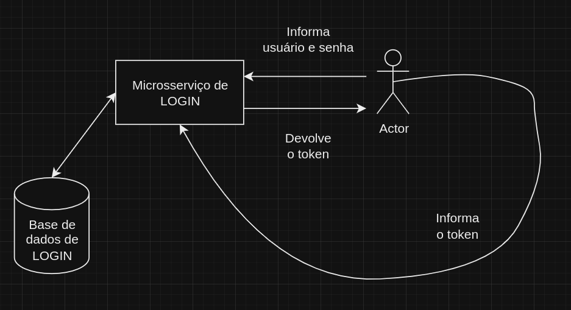
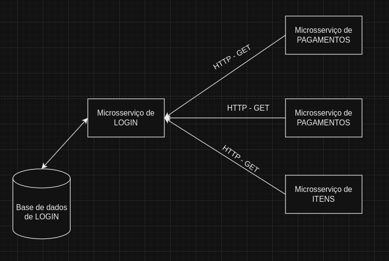

# FIAP-TechChallenge5-LOGIN

---

Quinto desafio da pós graduação da FIAP

---

Para executar o projeto junto com os outros microsserviços do desafio da FIAP-TechChallenge5,  na raiz do
projeto execute o docker-compose, pois ele provê a app e o banco de dados para se comunicar com os outros
microsserviços.

---

### Observações:

---

- Para executar os testes de `BDD`, a aplicação tem que estar rodando, juntamente com o banco de dados. Tem um docker-compose na raiz do projeto, ele provê a app, o banco de dados.

- Caso queira subir somente o banco de dados, para execucar a app localmente, tem um docker-compose no diretório `docker-banco-de-dados`.

- Para rodar os testes de performance com Gatling, execute o seguinte comando: `mvn gatling:test`
    - a aplicação tem que estar rodando, juntamente com o banco de dados. Tem um docker-compose na raiz do projeto, ele provê a app, o banco de dados.

---

### Integrações:

---

#### Que esse microsserviço utiliza:

- Nenhuma
- Porém, para realizar as operações neste serviço, é necessário estar autenticado no serviço. Para se autenticar, é
  necessário acessar o serviço de autenticação, e obter o token de acesso, via HTTP.
  

#### Que esse microsserviço fornece:

- A aplicação fornece via HTTP informações para verificar se o cliente que veio pelo token JWT, 
realmente existe na base de dados, para os microsserviços de PAGAMENTOS, 
CARRINHO DE COMPRAS e ITENS.

